[](https://scorecard.dev/viewer/?uri=github.com/finom/uicast)

# uicast

**The expression-driven generative UI framework.**

<picture>
  <source media="(prefers-color-scheme: dark)" srcset="packages/docs/public/uicast-hero-dark.svg">
  <source media="(prefers-color-scheme: light)" srcset="packages/docs/public/uicast-hero-light.svg">
  
</picture>

**uicast** renders a user interface that a language model writes at run time. You register components and functions. The model answers a request with a document that uses them, and the renderer shows it line by line as it streams. A document is data: it is never compiled or added to your bundle, so you can store it and render it again.

The logic in a document is written as expressions: JavaScript expressions over JSON data, run by an interpreter, not by the JavaScript engine. That language is [`@uicast/expr`](packages/expr).

## A document

A document is JSON Lines, one entry per line. Asked for open orders, a model can write:

```jsonl
{"key":"root","component":"Card","props":{"literal":{"title":"Open orders"}},"seed":[{"set":"scopes.root.orders","expr":"listOrders({ status: 'open' })"}],"children":["total","row","refresh"]}
{"key":"total","component":"Stat","props":{"expr":"({ label: 'Open total', value: scopes.root.orders.reduce((sum, o) => sum + o.total, 0) })"}}
{"key":"row","component":"Typography","each":"scopes.root.orders","as":"order","keyBy":"id","props":{"expr":"({ text: scopes.order.customer + ': $' + scopes.order.total })"}}
{"key":"refresh","component":"Button","props":{"literal":{"text":"Refresh"}},"callbacks":{"onClick":[{"set":"scopes.root.orders","expr":"listOrders({ status: 'open' })"}]}}
```

- `children` lists keys, and the tree is built from them. Each element renders when its line arrives; a child still on its way shows a skeleton.
- `seed` runs once, when the element mounts. Here it calls `listOrders`, a function you wrote, and stores the result in the `root` scope.
- A prop is a `literal` or an `expr`. `total` reads `scopes.root.orders`, so it updates when the orders change.
- `each` makes `row` a list: one element per order. `scopes.order` is that order.
- A callback runs steps. `set` is the only way to change state. Refresh loads the orders again, and the total and the rows update.

## What you write

A **definition** is what the model reads about a component: its name, when to use it, its props.

```ts
import { createComponentDefinition } from "@uicast/core";
import z from "zod";

export const StatDef = createComponentDefinition({
  name: "Stat",
  description: "One number with a label. Use it for a KPI, not for a table cell.",
  props: z.strictObject({
    label: z.string().meta({ description: "What the number means" }),
    value: z.number().meta({ description: "The number itself" }),
  }),
});
```

An **implementation** is the React component that renders it. It gets the props already evaluated and checked by the schema:

```tsx
import { createComponentImplementation } from "@uicast/react";

export const StatImpl = createComponentImplementation({
  def: StatDef,
  render: ({ label, value }) => (
    <p>
      {label}: <strong>{value}</strong>
    </p>
  ),
});
```

[`@uicast/shadcn-catalog`](packages/shadcn-catalog) is a reference catalog of 107 such pairs over shadcn/ui. The document above uses it.

A **host function** is one [standard tool](https://standard-tool.js.org/) per operation the model may call. `execute` runs where the document runs, usually the browser, so it calls your API:

```ts
import { standardTool } from "standard-tool";

export const listOrders = standardTool({
  name: "listOrders",
  description: "Orders, newest first.",
  inputSchema: z.object({ status: z.enum(["all", "open", "refunded"]).default("all") }),
  outputSchema: z.array(z.object({ id: z.number(), customer: z.string(), total: z.number() })),
  execute: ({ status }) => fetch(`/api/orders?status=${status}`).then((r) => r.json()),
});
```

The **system prompt** is built from your definitions (`defs`) and functions (`tools`). Every `description` reaches the model word for word:

```ts
import {
  getCommonInstructionsPartialPrompt,
  getComponentsPartialPrompt,
  getExpressionsPartialPrompt,
  getFunctionsPartialPrompt,
  getScopePartialPrompt,
} from "@uicast/core/prompt";

const system = [
  getCommonInstructionsPartialPrompt(),
  getScopePartialPrompt({ kind: "page" }),
  getComponentsPartialPrompt({ definitions: defs }),
  getFunctionsPartialPrompt({ functions: tools }),
  getExpressionsPartialPrompt(),
].join("\n\n");
```

**Rendering** takes a provider and a renderer. The evaluator is created once, with the host functions bound to it:

```tsx
import { Evaluator } from "@uicast/expr";
import { EntriesRenderer, RendererProvider } from "@uicast/react";

const evaluator = new Evaluator({ functions: tools });

<RendererProvider implementations={impls} evaluator={evaluator}>
  <EntriesRenderer entries={entries} />
</RendererProvider>;
```

`impls` holds your implementations. `entries` grows as lines stream in; [`streamJsonLines`](https://uicast.dev/streaming) reads them from the response. In a chat, the model puts entries in a ```` ```uicast ```` fence in its Markdown reply, and [`@uicast/streamdown`](packages/streamdown) renders the fence.

## Expressions

An expression is JavaScript: one expression, over JSON data.

```js
scopes.root.orders.filter((o) => o.total > 100).length  // → 1
listOrders({ status: "open" })                          // → calls your host function
fetch("/api/orders")                                    // ❌ ExpressionError: "fetch" is not available in expressions
({}).constructor                                        // ❌ undefined: inherited names are not readable
```

- The grammar is closed: every syntax node, operator, global and method is on an allow-list. Anything else is refused before it runs.
- An expression reads only own properties of plain data, and only JSON leaves it.
- There are no loops, no recursion and no function values, and every evaluation has a step, time and allocation budget.
- There is no `eval` or `new Function`, so a Content-Security-Policy needs no `unsafe-eval`.

The [`@uicast/expr` README](packages/expr) lists what is in the language and why the rest is not.

## Security

A document is untrusted input: a model wrote it, and a saved document runs in other people's browsers. The evaluator checks expressions. These stay your job:

- **Functions.** A document can call every function you bind. Bind only what it needs, and authorize every call on the server.
- **Components.** A document writes every prop. Declare URL props with `z.url()`, so [`urlPolicy`](https://uicast.dev/react/renderer#urlpolicy--the-urls-a-document-may-load) checks them, and never put document text where it can run.
- **Instructions in data.** A function result the model reads, as in a chat, can carry instructions the user never gave. The prompt tells the model to follow only the user, but that is not a boundary: check permissions in your functions.

See the [security model](https://uicast.dev/security) and [SECURITY.md](SECURITY.md).

## Install

```sh
npm install @uicast/expr@beta @uicast/core@beta @uicast/react@beta @uicast/shadcn-catalog@beta standard-tool zod
```

The packages are beta, under the `beta` dist-tag. `@uicast/react` needs React 19.2.

Or start from a Next.js app with all of it wired:

```sh
npx create-next-app@latest my-app --example https://github.com/finom/uicast/tree/main/examples/starter
```

[](https://vercel.com/new/clone?repository-url=https%3A%2F%2Fgithub.com%2Ffinom%2Fuicast%2Ftree%2Fmain%2Fexamples%2Fstarter&project-name=uicast-app&repository-name=uicast-app)

[Getting started](https://uicast.dev/getting-started) builds the same app step by step.

## Packages

| Package | What it is |
| --- | --- |
| [`@uicast/core`](packages/core) | The engine, without React: entry format, reactive scopes, error classification, prompt builders. |
| [`@uicast/react`](packages/react) | The React binding: provider, renderer, skeletons, an error boundary per element. |
| [`@uicast/expr`](packages/expr) | The expression language and its interpreter. Works on its own. |
| [`@uicast/shadcn-catalog`](packages/shadcn-catalog) | A reference catalog: 107 components over shadcn/ui and Radix, each with its definition. |
| [`@uicast/streamdown`](packages/streamdown) | A Streamdown plugin: documents inside ```` ```uicast ```` fences in Markdown chat replies. |

## Documentation

The full documentation is at [uicast.dev](https://uicast.dev). To start:

- [Concepts](https://uicast.dev/concepts): documents, entries, elements, scopes, expressions, steps.
- [Component definition](https://uicast.dev/def) and [implementation](https://uicast.dev/react): your own components.
- [Host functions](https://uicast.dev/expr/functions): changing data, confirmation, refetching.
- [Assembling the prompt](https://uicast.dev/prompt): the system prompt, block by block.
- [Entry fields](https://uicast.dev/entry): every field an entry can have.
- [Example app](https://uicast.dev/example-app): a back office where every table, form and detail view is generated.

Coding agents can install the [agent skill](https://uicast.dev/skill): `npx skills add finom/uicast`.

## Development

```sh
npm install
npm test
npm run typecheck
npm run lint
```

Node 24 or later. `npm run build` compiles every package to `dist/`. See [CONTRIBUTING.md](CONTRIBUTING.md).

## License

[MIT](LICENSE) © [Andrey Gubanov](https://github.com/finom)
